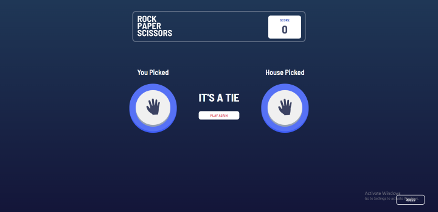
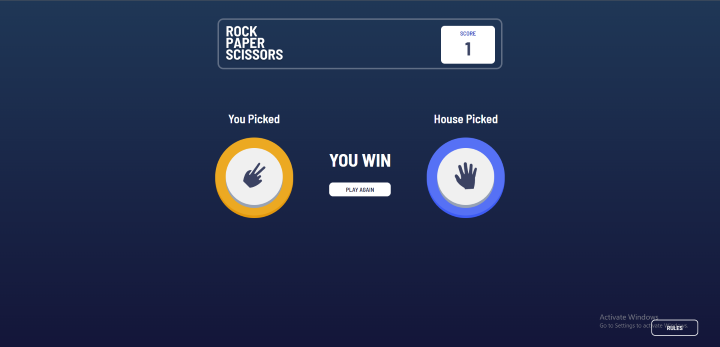
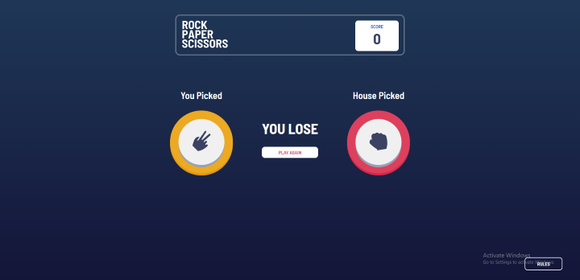
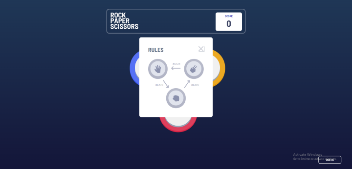
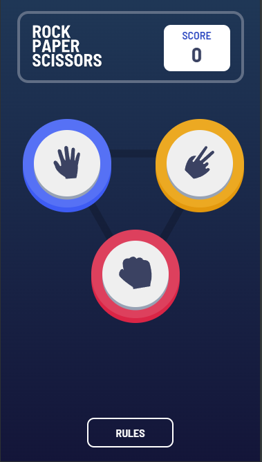
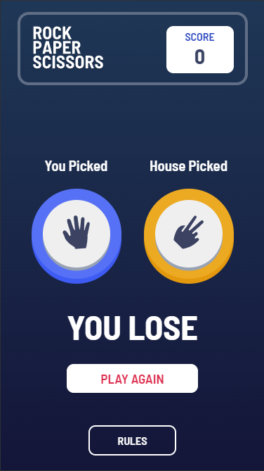
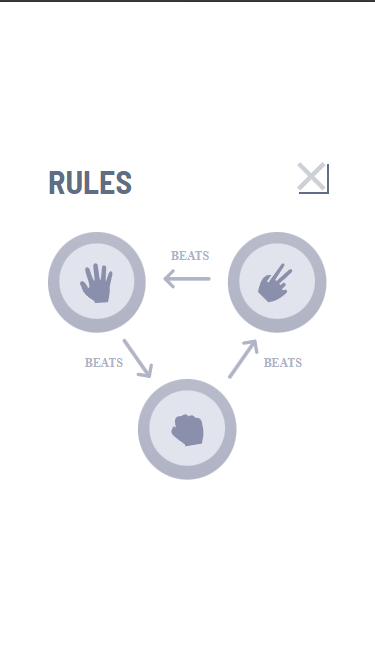

# Rock, Paper, Scissors solution

This is a solution to the [Rock, Paper, Scissors challenge on Frontend Mentor](https://www.frontendmentor.io/challenges/rock-paper-scissors-game-pTgwgvgH)

## Table of contents

- [Overview](#overview)
  - [The challenge](#the-challenge)
  - [Screenshot](#screenshot)
  - [Links](#links)
- [My process](#my-process)
  - [Built with](#built-with)
  - [What I learned](#what-i-learned)
  - [Continued development](#continued-development)
  - [Useful resources](#useful-resources)
- [Author](#author)
- [Acknowledgments](#acknowledgments)

**Note: Delete this note and update the table of contents based on what sections you keep.**

## Overview

### The challenge

Users should be able to:

- View the optimal layout for the game depending on their device's screen size
- Play Rock, Paper, Scissors against the computer
- The UI/UX Should be better

### Screenshot

### Rules

If the player wins, they gain 1 point. If the computer wins, the player loses one point.

#### Original

- Paper beats Rock
- Rock beats Scissors
- Scissors beats Paper

### Links

- Solution URL: [Add solution URL here](https://your-solution-url.com)
- Live Site URL: Localhost

## My process

### Built with

- Semantic HTML5 markup
- CSS custom properties
- Flexbox
- Position
- Dom Javascript
- Mobile-first workflow

### What I learned

* How to do UI/UX
* How to handle Errors
* FlexBox
* Positions
* Responsiveness
* Made my DOM concept strong

## Building your project

Feel free to use any workflow that you feel comfortable with. Below is a suggested process, but do not feel like you need to follow these steps:

1. Initialize your project as a public repository on [GitHub](https://github.com/). Creating a repo will make it easier to share your code with the community if you need help. If you're not sure how to do this, [have a read-through of this Try Git resource](https://try.github.io/).
2. Configure your repository to publish your code to a web address. This will also be useful if you need some help during a challenge as you can share the URL for your project with your repo URL. There are a number of ways to do this, and we provide some recommendations below.
3. Look through the designs to start planning out how you'll tackle the project. This step is crucial to help you think ahead for CSS classes to create reusable styles.
4. Before adding any styles, structure your content with HTML. Writing your HTML first can help focus your attention on creating well-structured content.
5. Write out the base styles for your project, including general content styles, such as `font-family` and `font-size`.
6. Start adding styles to the top of the page and work down. Only move on to the next section once you're happy you've completed the area you're working on.

### Useful resources

- [Stack Overflow](https://stackoverflow.com/) - To get the solution of errors i got
- [MDN Web Docs](https://developer.mozilla.org/en-US/) - To help me clear my concepts

## Author

- Name - Shaurya Srivastava (INDIA)
- Twitter - [@ShauryaSri88742yourusernam](https://www.twitter.com/yourusername)
